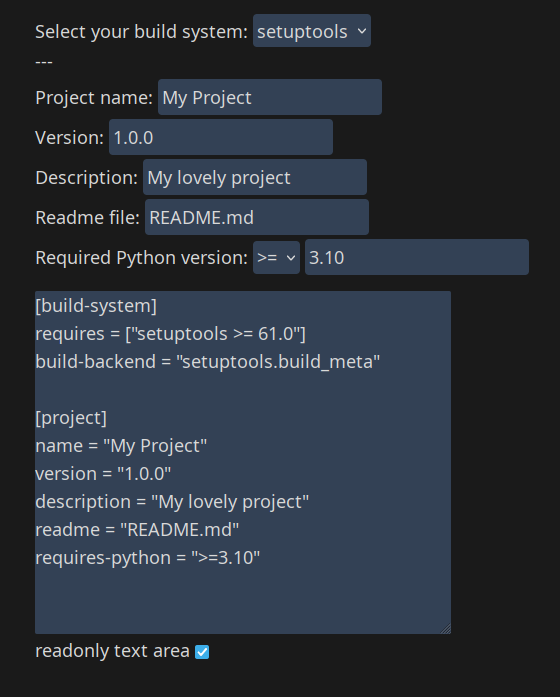

# Pyprojectgen

A pyproject.toml generator webapp for Python projects written in Svelte and Tailwind.

It is not finished yet, as currently it can not do every (popular) field.

(may not be entirely up to date: see supported fields)

## Building

Clone the repo, `pnpm i` (npm also works), and then `pnpm build` (`npm run build`) and it will build everything to `./dist`. After that, if you wish to use it as a one off occurance without deploying, run `pnpm preview` (`npm run preview`)

For development, simply clone and install the dependencies and `pnpm dev`

## Contributing

You can open an issue or a PR of what you want.

## Supported fields
- Build system
- Project name
- Version
- Description
- Readme file
- Required Python version
- Author (currently only 1)

## TODO
- Add multiple author support
- Add script support
- Add keywords
- Add classifiers
- Add urls
- Add license
